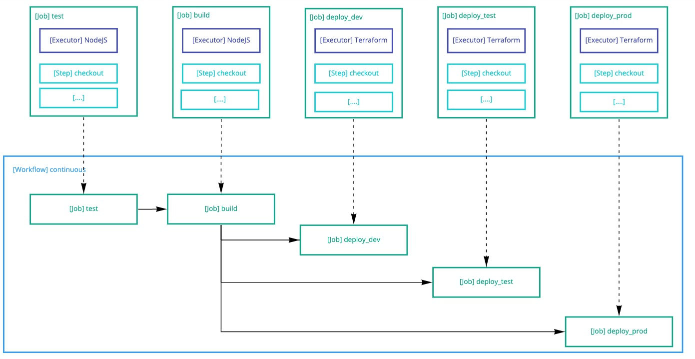
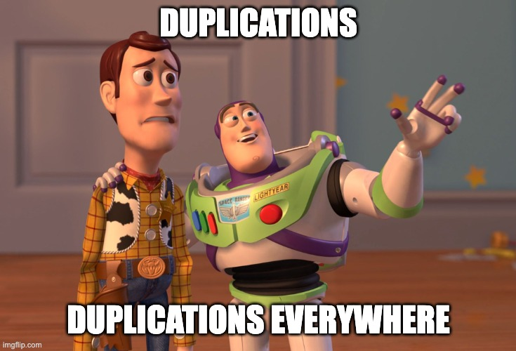
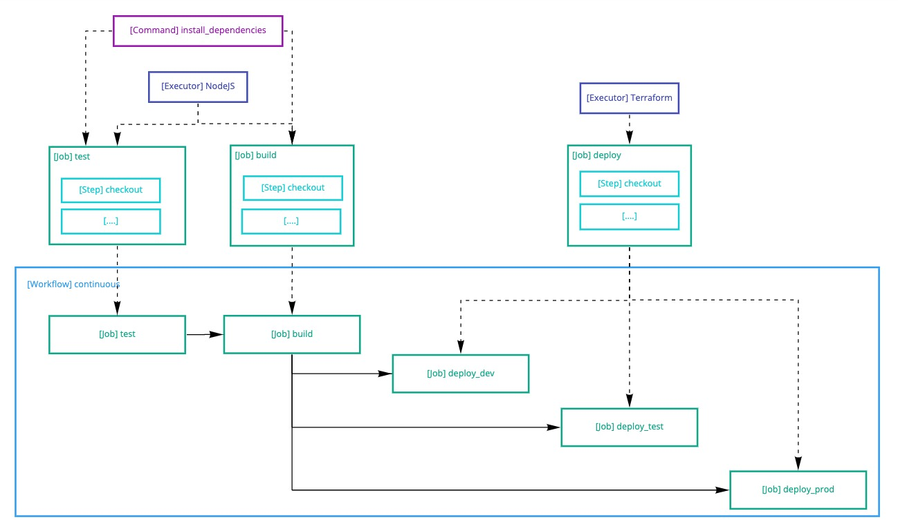
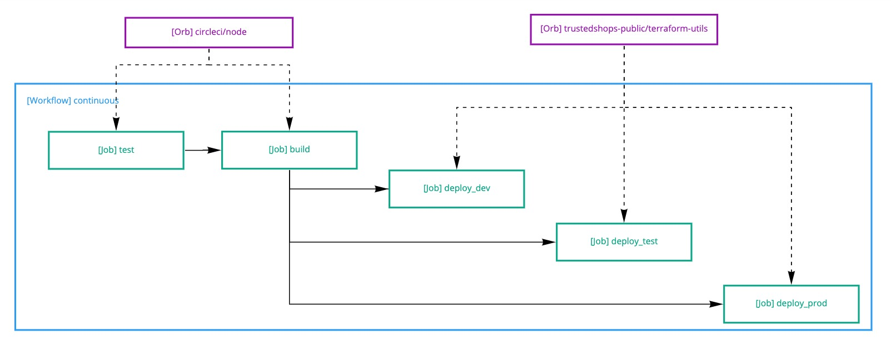

# CircleCI Orbs

What are orbs? Why do we use them at TrustedShops? How do I create new ones?

---

# Circleci Basics 101

----

# Basic Pipeline | Overview



---

# Basic Pipeline | Code 1/2

```yaml
version: 2.1

jobs:
  build:
    executor:
      docker:
        - image: cimg/node:lts
    steps:
      - checkout
      - restore_cache:
          key: node-modules-{{ checksum package-lock.json }}
      - run:
          name: Install dependencies
          command: npm install
      - save_cache:
          key: node-modules-{{ checksum package-lock.json }}
      - run:
          name: Build
          command: npm run build
      - persist_to_workspace:
          root: .
          paths:
            - dist/
    test:
      executor:
        docker:
          - image: cimg/node:lts
      steps:
        - checkout
        - restore_cache:
            key: node-modules-{{ checksum package-lock.json }}
        - run:
            name: Install dependencies
            command: npm install
        - save_cache:
            key: node-modules-{{ checksum package-lock.json }}
        - run:
            name: Run unit tests
            command: npm run test
# ...
```

---

# Basic Pipeline | Code 2/2

```yaml
# ...
jobs:
  deploy_dev:
    executor:
      docker:
        - image: terraform:1.0
    steps:
      - checkout
      - run:
          name: Initialize terraform
          command: |
            cd terraform
            terraform init
      - run:
          name: Apply
          command: |
            cd terraform
            terraform apply -var-file=vars/dev.tfvars -auto-approve=yes
    deploy_test:
      executor:
        docker:
          - image: terraform:1.0
      steps:
        - checkout
        - run:
            name: Initialize terraform
            command: |
              cd terraform
              terraform init
        - run:
            name: Apply
            command: |
              cd terraform
              terraform apply -var-file=vars/test.tfvars -auto-approve=yes
    deploy_prod:
      executor:
        docker:
          - image: terraform:1.0
      steps:
        - checkout
        - run:
            name: Initialize terraform
            command: |
              cd terraform
              terraform init
        - run:
            name: Apply
            command: |
              cd terraform
              terraform apply -var-file=vars/prod.tfvars -auto-approve=yes
```

---

# Whats wrong?

- duplicated executors and also versions!
- checkout, install dependencies is duplicated
- duplicated deployment jobs
- hard to read and update



---

# What can be done about it?

- YAML anchors?
- more shell scripts?
- task runner?

----

# No, its even easier!

- executors
    - define once, use as often as you want
- commands
    - reusable steps
    - parameterizable
- jobs
    - can also have parameters!

---

# Reusable pipeline | Overview



---

# Reusable pipeline | Code

```yaml
version: 2.1

executor:
  node:
    docker:
      - image: node:lts
  terraform:
    docker:
      - image: terraform:1.0

commands:
  install_dependencies:
    steps:
      - restore_cache:
          key: node-modules-{{ checksum package-lock.json }}
      - run:
          name: Install dependencies
          command: npm install
      - save_cache:
          key: node-modules-{{ checksum package-lock.json }}

jobs:
  build:
    executor: node
    steps:
      - checkout
      - install_dependencies
      - run:
          name: Build
          command: npm run build
      - persist_to_workspace:
          root: .
          paths:
            - dist/
    test:
      executor: node
      steps:
        - checkout
        - install_dependencies
        - run:
            name: Run unit tests
            command: npm run test
      deploy:
        executor: terraform
        parameters:
          env:
            type: string
            description: Environment to deploy
        steps:
          - checkout
          - run:
              name: Initialize terraform
              command: |
                cd terraform
                terraform init
          - run:
              name: Apply
              command: |
                cd terraform
                terraform apply --var-file vars/<<parameters.env>>.tfvars -auto-approve=yes
# ...
```

---

# Wouldn't it be great to have drop-in solutions for this?

---

# There comes CircleCI Orbs!

- semantic versioned
- versions are immutable, so there a no surprises
- can contain building blocks for your pipelines:
    - executors
    - commands
    - jobs

---

# "Orbified" pipeline | Overview



---

# "Orbified" pipeline | Code

```yaml
version: 2.1

anchors:
  terraform-defaults: &terraform_defaults 
    terraform-version: 1.0.11
    path: terraform

orbs:
  terraform-utils: trustedshops-public/terraform-utils@1.5.0
  node: circleci/node@4.7.0

workflows:
  continuous:
    - node/test:
        name: test
    - node/run:
        name: build
        npm-run: test
        requires:
          - test
    - terraform-utils/terraform-apply:
        name: deploy_test
        <<: *terraform_defaults
        var-file: vars/test.tfvars
        requires:
          - build
        # filters, contexts ..
    - terraform-utils/terraform-apply:
        name: deploy_test
        <<: *terraform_defaults
        var-file: vars/test.tfvars
        requires:
          - build
        # filters, contexts ..
    - terraform-utils/terraform-apply:
        name: deploy_prod
        <<: *terraform_defaults
        var-file: vars/prod.tfvars
        requires:
          - build
        # filters, contexts ..
```

---

# Where to find them

- via google (`circleci orb search term`)
- https://circleci.com/developer/orbs
- in the `trustedshops-public` org, search for repos starting with `circleci-orb-`

---

# Creating orbs at TrustedShops has never been easier!

- create a repository in the `trustedshops-public` org with the help from someone in the OpenSource Guild
- ```cookiecutter gh:trustedshops-public/cookiecutter-circleci-orb```
- enter the name of the orb
- develop your orb, batteries included with a preconfigured CircleCI pipeline
    - automatic releases on semantic commits
    - snapshots on feature branches to test your orbs before publishing them

---

# Orb source structure

You can write orbs a single YAML, but that's no fun.

So orbs are split into multiple files and bundled at deploy time:

```
|- src
  |- commands
    |- command-name.yml
  |- examples
    |- example-name.yml
  |- jobs
    |- job-name.yml
  |- executors
    |- executor-name.yml
  |- scripts
    |- script-to-source.sh
```

Each of the directories is optional.

---

# Orbs - The ugly

- once published there is no way back - the orb can only be deleted in special cases by support
- 3 private orbs per org on our plan (seriously?!)
- only admin can create and update orbs (TPS DevOps team built a workaround for that)

---

# Best Practices

---

# Best Practices | Using orbs

- prefer orbs over inline solutions
- only use official, certified or our own orbs
- upgrade orbs from time to time

---

# Best Practices | Creating orbs

- use official orbs functionality as base when possible (e. g. aws cli)
- create commands for building blocks
- a job should also be executable using commands from the orb
- pass parameters through with the same defaults.gitignore
- provide at least one example per job and one to use composite commands
- do one thing and do it good
- make the orb flexible with parameters but provide sensitive defaults
- keep it generic and free from "TrustedShops specials"

---

# End


